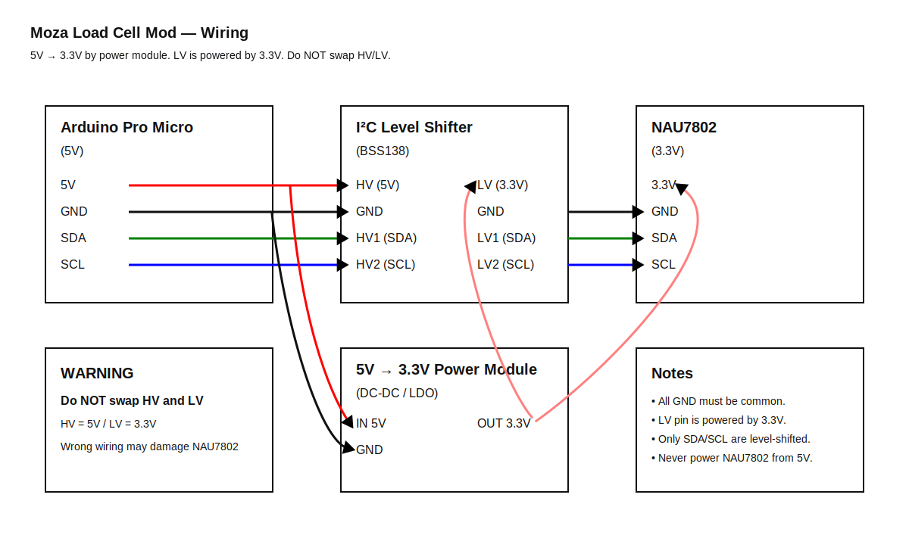
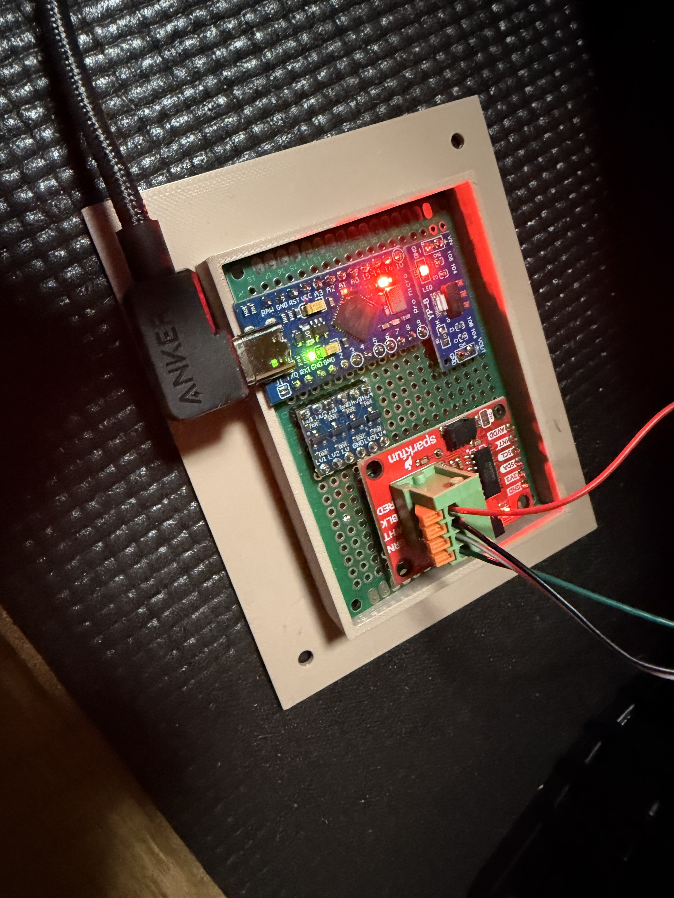
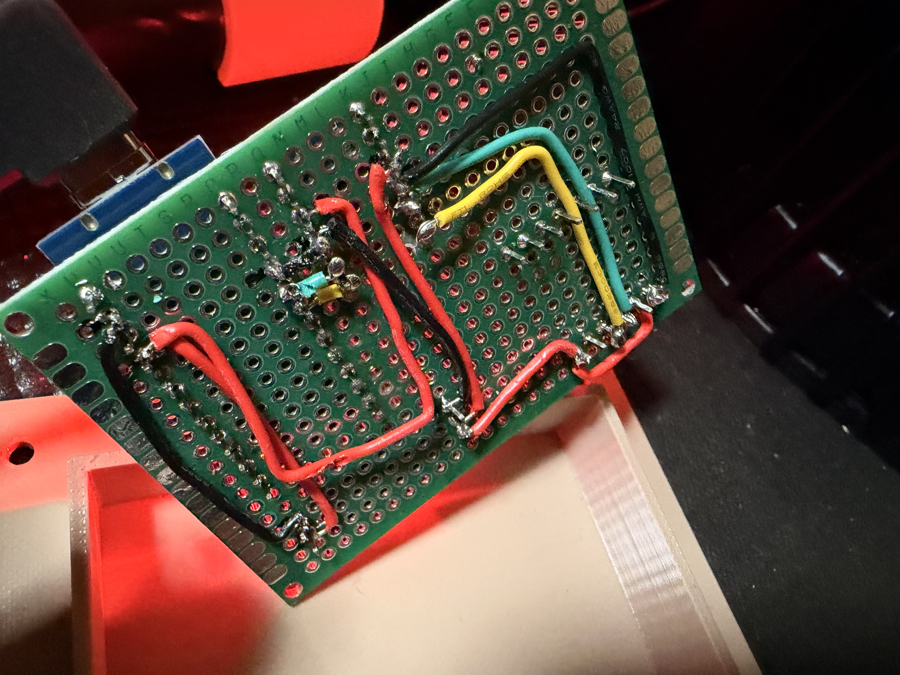
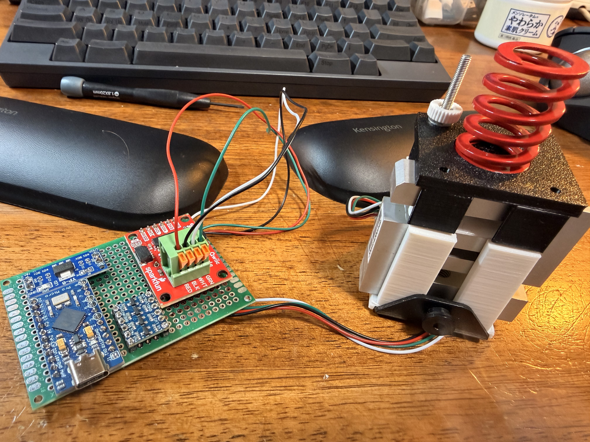

# Moza Load Cell Mod

## English

This project converts the **brake pedal of the Moza CR-P Lite Pedals into a load-cell based system**.  
The goal is to enable force-based braking input and achieve a more realistic driving feel.

---

### Hardware Overview

An **Arduino Pro Micro compatible board** is used as a  
**USB HID joystick controller**.

Pro Micro compatible board used in this project:  
https://www.amazon.co.jp/dp/B0DHGTNMHH

The load cell used is the **Akizuki Denshi 100 kg load cell (SC301A)**.  
https://akizukidenshi.com/catalog/g/g112036/

The load cell amplifier is **SparkFun Qwiic Scale – NAU7802**.  
It was selected to enable **high-speed sampling at 320 SPS**, which is not possible with the HX711.  
https://www.sparkfun.com/sparkfun-qwiic-scale-nau7802.html

The system uses:
- **5 V logic (Arduino Pro Micro)**
- **3.3 V logic (NAU7802)**

Therefore, **power conversion (5V → 3.3V)** and **I²C level shifting** are required.

---

### Power Conversion (5V → 3.3V)

A dedicated **5V → 3.3V power module** is used.  
The generated **3.3 V is supplied to both the NAU7802 and the LV pin of the level shifter**.

Amazon (Japan):  
https://www.amazon.co.jp/dp/B0BJJBG8C4

**Important**
- NAU7802 is **not 5V tolerant**
- Never connect NAU7802 directly to 5 V
- All GND connections must be common

---

### Level Shifter Used

A **BSS138-based I²C bidirectional level shifter** is used.

Amazon (Japan):  
https://www.amazon.co.jp/dp/B086WWCJGQ

Any equivalent BSS138-based bidirectional I²C level shifter can be used.

---

### Wiring (I²C Level Shifting)

Only **SDA, SCL, VCC, and GND** are required.

- HV side: **5 V (Arduino Pro Micro)**
- LV side: **3.3 V (from power module)**

| Arduino Pro Micro (5V) | Level Shifter (HV) | Level Shifter (LV) | NAU7802 (3.3V) |
|------------------------|-------------------|-------------------|---------------|
| SDA                    | HV1               | LV1               | SDA           |
| SCL                    | HV2               | LV2               | SCL           |
| GND                    | GND               | GND               | GND           |
| —                      | —                 | LV (3.3V)         | 3.3V          |

---

### ⚠ WARNING: HV / LV Connection

**Do NOT swap HV and LV connections.**

- **HV must be 5 V**
- **LV must be 3.3 V**

Reversing HV and LV may:
- Break I²C communication
- Permanently damage the NAU7802
- Damage the level shifter itself

Always double-check before powering on.

---

### Wiring Diagram (SVG)

- Open SVG directly: [docs/wiring.svg](docs/wiring.svg)

---

## Files

### Firmware

- **loadcell_brake.ino**  
Arduino firmware for the load-cell brake pedal.  
Compile and upload this sketch using the Arduino IDE.  
After flashing, the board is recognized as a USB HID joystick.

### 3D Printed Parts

- **top.stl**  
- **bottom.stl**  

These parts clamp the load cell and allow it to be mounted inside the pedal assembly.

### Design Source

- **sr-p lite pedal loadcell mount v1.f3d**  

Fusion 360 design file used to generate the STL files above.

---

## Required Libraries

The following Arduino libraries are required to compile the firmware:

- **Arduino Joystick Library**  
  https://github.com/MHeironimus/ArduinoJoystickLibrary

- **SparkFun Qwiic Scale NAU7802 Library**  
  https://github.com/sparkfun/SparkFun_Qwiic_Scale_NAU7802_Arduino_Library

Make sure both libraries are installed before compiling.

---

## Arduino IDE Setup (SparkFun AVR Boards)

To compile and upload the firmware correctly, the **SparkFun AVR Boards** definition is used.

1. Open **File > Preferences**  
   Add the following URL to **Additional Boards Manager URLs**:
https://raw.githubusercontent.com/sparkfun/Arduino_Boards/master/IDE_Board_Manager/package_sparkfun_index.json

2. Open **Tools > Board > Boards Manager**, search for **sparkfun**,  
and install **SparkFun AVR Boards by SparkFun Electronics**.

3. Select the board:  
**Tools > Board > SparkFun AVR Boards > SparkFun Pro Micro**

4. Select the processor:  
**Tools > Processor > ATmega32U4 (5V, 16 MHz)**

---

## Reset and Enter Bootloader

If the board does not appear for upload or the upload fails:

1. With the board connected to the PC, **short RST and GND twice quickly**  
(on this board, **pin 3 and pin 4**).

2. The bootloader will start and the board will reappear briefly.  
**Upload the sketch immediately** while the bootloader is active.

---

### Photos

| Description | Link |
|------------|------|
| PCB (top) | [docs/pcb_top.jpg](docs/pcb_top.jpg) |
| PCB (bottom) | [docs/pcb_bottom.jpg](docs/pcb_bottom.jpg) |
| With 3D printed parts | [docs/with_3d_parts.jpg](docs/with_3d_parts.jpg) |
| Installed in pedal | [docs/installed_in_pedal.jpg](docs/installed_in_pedal.jpg) |
| Overall finished assembly | [docs/final_overview.jpg](docs/final_overview.jpg) |

Show photo previews

---

### Usage

When connected to Windows, the device is recognized as a  
**USB joystick with one axis and one button**.

To calibrate the maximum brake force:
- Press the brake **firmly for about 2 seconds**

Calibration is performed automatically.

---

### Notes and Warnings

The **spring terminals on the SparkFun Qwiic Scale – NAU7802 are unreliable**.  
Even if a wire appears to be properly inserted, electrical contact may fail.

It is strongly recommended to:
- Solder pin headers, or
- Replace the terminals with more reliable connectors

---
## 日本語

このプロジェクトは、**Moza CR-P Lite Pedals のブレーキペダルをロードセル方式に改造する**ものです。  
踏力に応じた入力を可能にし、より実車に近いブレーキフィールを得ることを目的としています。

---

### ハードウェア構成

本プロジェクトでは、**Arduino Pro Micro 互換ボード**を  
**USB HID ジョイスティックコントローラ**として使用しています。

使用した Pro Micro 互換ボード：  
https://www.amazon.co.jp/dp/B0DHGTNMHH

ロードセルには **秋月電子 100kg ロードセル（SC301A）** を使用しています。  
https://akizukidenshi.com/catalog/g/g112036/

ロードセルアンプには **SparkFun Qwiic Scale – NAU7802** を採用しました。  
HX711 では不可能な **320 SPS の高サンプリングレート**での取得を目的として選定しています。  
https://www.sparkfun.com/sparkfun-qwiic-scale-nau7802.html

本構成では、
- **5V 系（Arduino Pro Micro）**
- **3.3V 系（NAU7802）**

の 2 系統のロジック電圧を使用するため、  
**電源変換（5V → 3.3V）**および **I²C レベル変換**が必要になります。

---

### 電源変換（5V → 3.3V）

**5V → 3.3V の電源変換モジュール**を使用しています。  
生成した **3.3V は NAU7802 とレベル変換モジュールの LV ピンの両方に供給**します。

使用した電源変換モジュール：  
https://www.amazon.co.jp/dp/B0BJJBG8C4

**重要**
- NAU7802 は **5V 非対応（3.3V 専用）**です  
- NAU7802 に 5V を直接接続しないでください  
- GND は必ずすべて共通にしてください  

---

### 使用したレベル変換モジュール

**BSS138 MOSFET を使用した I²C 双方向レベル変換モジュール**を使用しています。

Amazon（日本）：  
https://www.amazon.co.jp/dp/B086WWCJGQ

同等仕様の **BSS138 ベース双方向 I²C レベル変換モジュール**であれば代替可能です。

---

### 配線（I²C レベル変換）

必要な信号は **SDA / SCL / VCC / GND** のみです。

- HV 側：**5V（Arduino Pro Micro）**
- LV 側：**3.3V（電源変換モジュール）**

| Arduino Pro Micro (5V) | レベル変換（HV） | レベル変換（LV） | NAU7802 (3.3V) |
|------------------------|------------------|------------------|----------------|
| SDA                    | HV1              | LV1              | SDA            |
| SCL                    | HV2              | LV2              | SCL            |
| GND                    | GND              | GND              | GND            |
| —                      | —                | LV (3.3V)        | 3.3V           |

---

### ⚠ 警告：HV / LV の逆接続について

**HV と LV を逆に接続しないでください。**

- **HV は必ず 5V**
- **LV は必ず 3.3V**

逆接続すると、
- I²C 通信が成立しない  
- NAU7802 が恒久的に破損する  
- レベル変換モジュール自体が破損する  

可能性があります。  
通電前に必ず配線を再確認してください。

---

### 配線図（SVG）

- SVG を直接開く: [docs/wiring.svg](docs/wiring.svg)

---

## ファイル構成

### ファームウェア

- **loadcell_brake.ino**  
  ロードセル式ブレーキ用の Arduino ファームウェアです。  
  Arduino IDE でコンパイルし、ボードに書き込んでください。  
  書き込み後は USB HID ジョイスティックとして認識されます。

### 3Dプリント部品

- **top.stl**  
- **bottom.stl**  

ロードセルを挟み込み、ペダル内部に固定するための部品です。

### 設計データ

- **sr-p lite pedal loadcell mount v1.f3d**  

上記 STL ファイルの元となった Fusion 360 の設計データです。

---

## 必要なライブラリ

ファームウェアをコンパイルするには、以下の Arduino ライブラリが必要です。

- **Arduino Joystick Library**  
  https://github.com/MHeironimus/ArduinoJoystickLibrary

- **SparkFun Qwiic Scale NAU7802 Library**  
  https://github.com/sparkfun/SparkFun_Qwiic_Scale_NAU7802_Arduino_Library

コンパイル前に、必ず両方のライブラリを Arduino IDE にインストールしてください。

---

## Arduino IDE 設定（SparkFun AVR Boards）

本プロジェクトでは **SparkFun AVR Boards** のボード定義を使用します。

1. **File > Preferences（ファイル > 環境設定）** を開き、  
   **Additional Boards Manager URLs** に以下を追加します。  
https://raw.githubusercontent.com/sparkfun/Arduino_Boards/master/IDE_Board_Manager/package_sparkfun_index.json

2. **Tools > Board > Boards Manager** を開き、  
**sparkfun** で検索し、  
**SparkFun AVR Boards by SparkFun Electronics** をインストールします。

3. ボードを選択します。  
**Tools > Board > SparkFun AVR Boards > SparkFun Pro Micro**

4. プロセッサを選択します。  
**Tools > Processor > ATmega32U4 (5V, 16 MHz)**

---

## リセットしてブートローダーを起動

書き込み時にボードが表示されない、またはアップロードに失敗する場合：

1. PC に接続した状態で、**RST と GND を素早く 2 回ショート**させます  
（このボードでは **3 番ピンと 4 番ピン**）。

2. ブートローダーが起動し、短時間だけボードが認識されます。  
**その間にスケッチを書き込んでください**。

---

### 写真

| 内容 | リンク |
|------|------|
| 基板（表） | [docs/pcb_top.jpg](docs/pcb_top.jpg) |
| 基板（裏） | [docs/pcb_bottom.jpg](docs/pcb_bottom.jpg) |
| 3Dプリント部品と組み合わせた状態 | [docs/with_3d_parts.jpg](docs/with_3d_parts.jpg) |
| ペダルに組み込んだ状態 | [docs/installed_in_pedal.jpg](docs/installed_in_pedal.jpg) |
| 完成状態全体 | [docs/final_overview.jpg](docs/final_overview.jpg) |

写真プレビュー

---

### 使用方法

Windows に接続すると、  
**1軸＋1ボタンの USB ジョイスティック**として認識されます。

最大踏力のキャリブレーションは、  
**ブレーキを約 2 秒間、強めに踏み込む**ことで自動的に行われます。

---

### 注意事項

**SparkFun Qwiic Scale – NAU7802 のスプリングターミナルは接触不良を起こしやすい**です。  
見た目上は接続できていても、実際には導通していないことがあります。

- ピンヘッダをはんだ付けする  
- 信頼性の高い端子に交換する  

ことを強く推奨します。

ことを強く推奨します。
